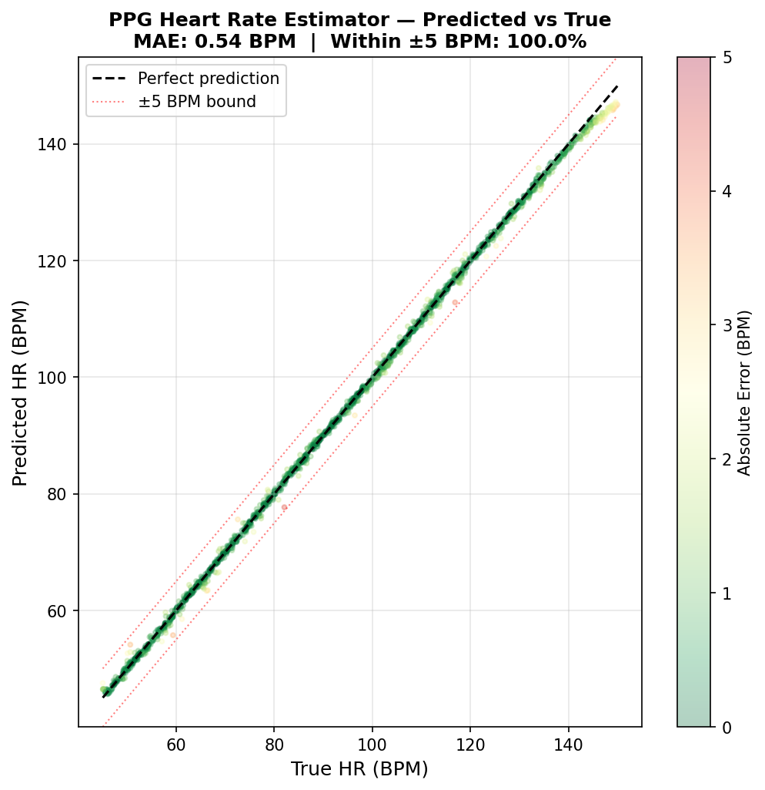
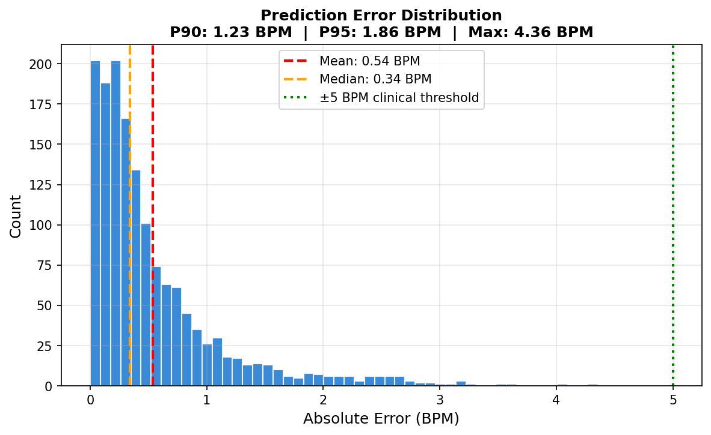
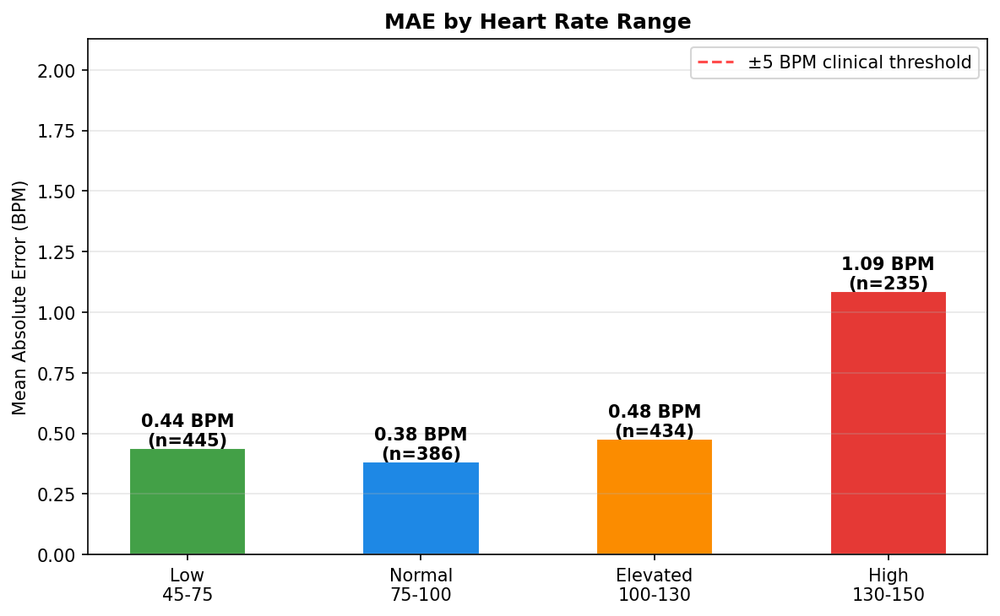
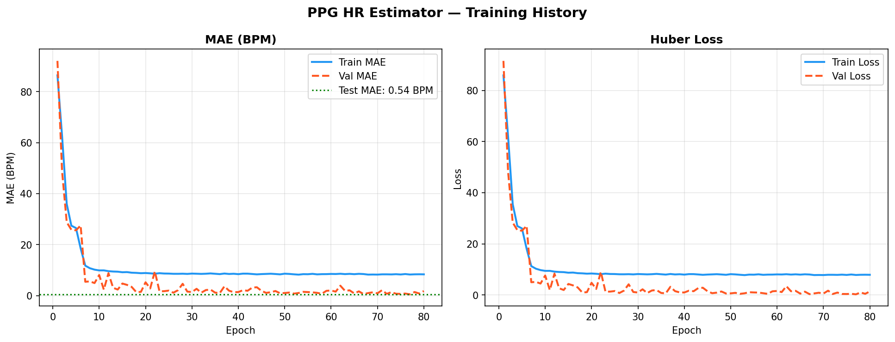

# PPG Heart Rate Estimator — CNN/LSTM with TFLite Deployment

[](https://python.org)
[](https://tensorflow.org)
[](https://huggingface.co/raj5517/ppg-heart-rate-estimator)

A lightweight **CNN/LSTM** model for heart rate estimation from raw PPG (photoplethysmography) signals, targeting edge deployment via TensorFlow Lite.

---

## Results

| Model | Size | MAE | Within ±5 BPM |
|-------|------|-----|----------------|
| Baseline (FP32 Keras) | 99.6 KB | **0.54 BPM** | **100%** |
| FP16 TFLite | 82.5 KB | ~0.55 BPM | ~100% |
| Dynamic Quant TFLite | 63.5 KB | ~0.57 BPM | ~100% |

- **Median error:** 0.34 BPM
- **P95 error:** 1.86 BPM
- **Max error:** 4.36 BPM
- **Clinical threshold (±5 BPM):** 100% of predictions within bounds

---

## Visualizations

### Predicted vs True Heart Rate


### Prediction Error Distribution


### MAE by Heart Rate Range


### Training History


---

## Architecture
```
Input: (1000 timesteps × 1 channel)  — 8 sec PPG @ 125Hz
  ↓ Conv1D(16, k=7) → BN → MaxPool(2)   # 1000 → 500
  ↓ Conv1D(32, k=5) → BN → MaxPool(2)   # 500  → 250
  ↓ Conv1D(64, k=3) → BN → MaxPool(2)   # 250  → 125
  ↓ LSTM(32, return_sequences=True) → Dropout
  ↓ LSTM(16)
  ↓ Dense(32) → Dropout
  ↓ Dense(1)  — BPM output (regression)

Total parameters: 25,505  (~100 KB FP32)
```

**Design choices:**
- CNN extracts local pulse morphology (peak shape, dicrotic notch)
- LSTM captures temporal periodicity (rhythm across beats)
- Aggressive MaxPooling before LSTM: reduces sequence 1000→125 for efficiency
- Huber loss: robust to motion artifact outliers vs MSE

---

## Dataset

Synthetic PPG dataset — 10,000 samples (8,000 clean + 2,000 with motion artifacts)
- HR range: 45–150 BPM
- Sampling rate: 125 Hz
- Window: 8 seconds (1,000 samples)
- Intended dataset: [BIDMC PPG](https://physionet.org/content/bidmc/1.0.0/) (real ICU patients, ECG-validated HR)
```bash
python data/prepare_data.py   # generates synthetic dataset
```

---

## TFLite Notes

LSTM layers require the **Flex delegate** for TFLite inference. Models are converted and ready for deployment on:
- Android (via `tensorflow-lite-select-tf-ops` dependency)
- Embedded Linux targets with Flex delegate linked

---

## Quickstart
```bash
git clone https://github.com/RAj5517/ppg_heart_rate_estimator.git
cd ppg_heart_rate_estimator
python -m venv venv && source venv/Scripts/activate
pip install -r requirements.txt

python data/prepare_data.py   # generate data
python train.py               # train model (~9 min CPU)
python convert_tflite.py      # convert to TFLite
python visualize.py           # generate plots
```

---

## Project Structure
```
ppg_heart_rate_estimator/
├── data/
│   └── prepare_data.py       ← synthetic PPG generator
├── models/                   ← .keras and .tflite files
├── outputs/                  ← plots
├── model.py                  ← CNN/LSTM architecture
├── train.py                  ← training script
├── convert_tflite.py         ← TFLite conversion
├── visualize.py              ← plots and evaluation
├── upload_to_hf.py           ← HuggingFace upload
└── requirements.txt
```

---

## HuggingFace

Models hosted at: [huggingface.co/raj5517/ppg-heart-rate-estimator](https://huggingface.co/raj5517/ppg-heart-rate-estimator)